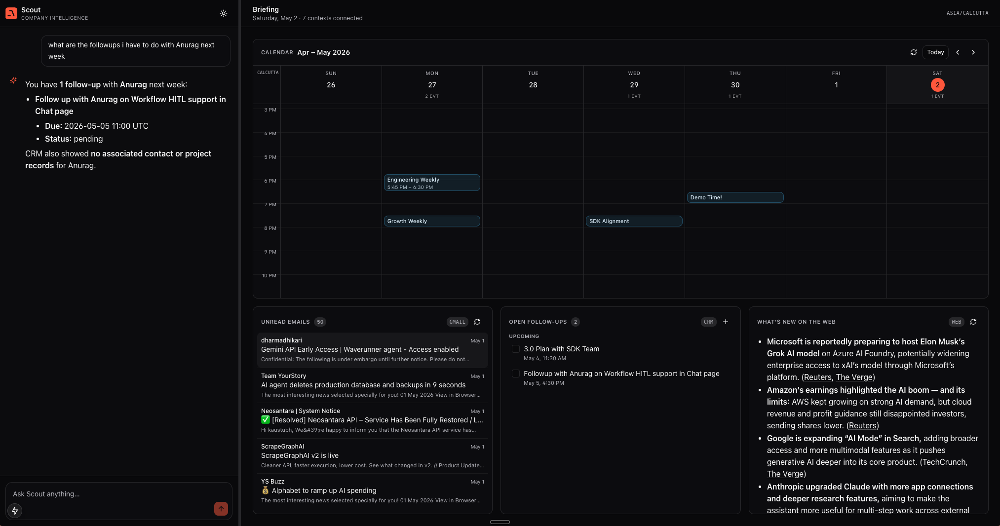

# Scout UI

A live, single-page dashboard for Scout. Chat with the agent on the left, watch your day on the right.

The screen is **fixed in shape but live in data**. A real Google Calendar week grid (paginated week-by-week), a scrollable Gmail inbox view (open thread, mark read/unread), a Postgres-backed follow-ups list (add, check off), and an LLM-summarized "what's new on the web" card. The chat panel streams Scout's responses token-by-token over SSE.



## Quick start

> **Prerequisites:**
> - Docker Desktop installed and running
> - A Google Cloud OAuth client (Desktop app) with the Gmail and Calendar APIs enabled — needed for personal Gmail/Calendar access. ~10 min in [Google Cloud Console](https://console.cloud.google.com/)
> - An OpenAI API key
> - The agno repo cloned at a known path (the Gmail/Calendar context providers live on a feature branch — see [Why agno is editable-mounted](#why-agno-is-editable-mounted))

```sh
# From the scout repo root
cp example.env .env
```

Edit `.env` and fill:

```sh
OPENAI_API_KEY=sk-...
GOOGLE_CLIENT_ID=<from Google Cloud Console>
GOOGLE_CLIENT_SECRET=<from Google Cloud Console>
GOOGLE_PROJECT_ID=<your project id>
```

Run the one-time OAuth flow on your **host** (it opens a browser):

```sh
# Install the OAuth helper into a throwaway venv
python3 -m venv .scout/oauth-venv
.scout/oauth-venv/bin/pip install --quiet google-auth-oauthlib

# Run the flow — opens browser windows for Gmail (modify scope) and Calendar (read-only)
PYTHON_BIN=$(pwd)/.scout/oauth-venv/bin/python ./scripts/google_oauth_setup.sh
```

Tokens are written to `.scout/gmail_token.json` and `.scout/calendar_token.json`. The compose file bind-mounts the repo into `scout-api`, so the container reads them automatically.

Boot the stack:

```sh
docker compose up -d --build
```

Three services come up:

| Service     | URL                                                        | What it is                          |
|-------------|------------------------------------------------------------|-------------------------------------|
| `scout-web` | [http://localhost:3000](http://localhost:3000)             | Chat + briefing dashboard           |
| `scout-api` | [http://localhost:8000/docs](http://localhost:8000/docs)   | FastAPI + AgentOS                   |
| `scout-db`  | `localhost:5432`                                            | Postgres + pgvector                 |

Open `http://localhost:3000`. You should see today's calendar in a week grid, your unread Gmail digest, your open follow-ups (empty until you add one), and a web summary.

## Try it

In the chat panel:

- *"What should I focus on this week?"* — Scout reads your calendar + email
- *"Show me emails from Anurag this week"* — calls `query_gmail`
- *"Remind me to follow up with Rakesh on Tuesday"* — calls `update_crm`, the new follow-up appears in the dashboard card
- *"What's the latest on agno?"* — calls `query_web`

In the dashboard:

- **Calendar:** drag with `Today` / `<` / `>`, click an event to open it in Google Calendar (hover for the icon)
- **Unread emails:** click any email to open the thread in a modal, with **Mark read** / **Mark unread**
- **Follow-ups:** `+` to add, checkbox to mark done — both round-trip to Postgres directly
- **Theme toggle** in the chat header (top right): light / dark, persists to localStorage
- **Resize the chat panel** by dragging the splitter between the two panels (or `Tab` to it and use arrows)

## Architecture

```
+----------------------------------------------------------+
|  Browser (scout-web on :3000)                            |
|  Next.js 15 + Tailwind + shadcn-style UI                 |
|                                                          |
|  ChatPanel ----------+------------------+---------+      |
|                      | SSE stream       |         |      |
|                      v                  |         |      |
|  WeekCalendar -------+------------+     |         |      |
|  UnreadEmailsCard ---+----+       |     |         |      |
|  EmailModal ---------+    |       |     |         |      |
|  FollowupsCard ------+--+ |       |     |         |      |
|  BriefingCard (web) -+  | |       |     |         |      |
|                      |  | |       |     |         |      |
|                      v  v v       v     v         v      |
+----------------------------------------------------------+
                       |
                       | direct REST              SSE
                       v                          v
+----------------------------------------------------------+
|  scout-api on :8000  (FastAPI + AgentOS)                 |
|                                                          |
|  Direct toolkit endpoints           Agent / providers    |
|  --------------------------         -----------------    |
|  GET  /calendar/events              POST /agents/scout/  |
|  GET  /gmail/unread                       runs           |
|  GET  /gmail/thread/{id}                                 |
|  POST /gmail/message/{id}/mark      Scout (single Agent) |
|  GET  /crm/followups                  tools = providers  |
|  POST /crm/followups                    .get_tools()     |
|  PATCH /crm/followups/{id}                               |
|                                                          |
|       |                                  |               |
|       v                                  v               |
|  GoogleCalendarTools           CalendarContextProvider   |
|  GmailTools                    GmailContextProvider      |
|  SQLAlchemy                    DatabaseContextProvider   |
|                                WikiContextProvider x 2   |
|                                WebContextProvider        |
|                                WorkspaceContextProvider  |
|                                                          |
+----------------------------------------------------------+
                       |                |
                       v                v
                +-------------+   +------------+
                | Google APIs |   | Postgres   |
                | OAuth       |   | (scout-db) |
                +-------------+   +------------+
```

### Two ways to talk to the same data

**Dashboard cards bypass the agent.** When the calendar widget needs events, it hits `/calendar/events?from=…&to=…` which builds a `GoogleCalendarTools` instance directly, calls `fetch_all_events`, and returns JSON. Same for `/gmail/unread`, `/gmail/thread/{id}`, and `/gmail/message/{id}/mark`. No LLM in the loop. Three reasons:

1. **Speed.** A structured fetch shouldn't pay an LLM hop.
2. **Reliability.** The Google Python client uses `httplib2` with connection pooling that occasionally surfaces `ssl WRONG_VERSION_NUMBER` on idle connections. The agent has no way to retry the underlying call — it just relays the error. Our endpoints rebuild the toolkit on each retry (= fresh connection pool), which clears the bad connection. See [Troubleshooting](#troubleshooting).
3. **Structured output.** The dashboard wants `{events: [...]}`, not paragraph text.

**Chat goes through the providers.** `POST /agents/scout/runs` routes through Scout (a single `agno.Agent`). Scout's tool list is `[provider.get_tools() for each registered provider]` plus `list_contexts`. When you ask *"what do I have with Anurag next week"*, Scout calls `query_calendar`, which spins up the `CalendarContextProvider`'s sub-agent, which uses `GoogleCalendarTools`. The provider layer is the LLM wrapper that converts natural-language questions into structured tool calls.

Both paths share the same OAuth tokens (`.scout/{gmail,calendar}_token.json`) and the same underlying toolkits — there's no double-auth or divergent state.

### Streaming chat

The chat panel uses `POST /agents/scout/runs` with `stream=true`. AgentOS returns Server-Sent Events with the format `event: <RunEvent>\ndata: <json>\n\n`. The frontend (`web/lib/scout.ts:streamAgent`) reads the response body as a `ReadableStream`, parses SSE blocks, and dispatches typed events to the UI:

| Event              | UI effect                                                |
|--------------------|----------------------------------------------------------|
| `RunStarted`       | Capture `session_id` for follow-up turns                 |
| `ToolCallStarted`  | Status line flips to `calling query_gmail…`              |
| `ToolCallCompleted`| Status returns to `thinking…`                            |
| `RunContent`       | Append `content` delta to the assistant message          |
| `RunCompleted`     | Clear status                                             |
| `RunError`         | Replace message with error                               |

`EventSource` doesn't support POST + multipart, so we use `fetch` with a manual SSE parser instead.

### Why agno is editable-mounted

The Gmail and Calendar `ContextProvider` classes are on the agno `feat/google-context-providers` branch and **not yet shipped on PyPI**. The `scout-api` Dockerfile installs `agno==2.6.4` from PyPI, which doesn't have those modules. Compose mounts your local agno checkout over the wheel install:

```yaml
volumes:
  - .:/app
  - /Users/kaustubh/Desktop/Agno/agno/libs/agno/agno:/usr/local/lib/python3.12/site-packages/agno
```

The mount path is hardcoded — adjust it to wherever your local agno repo lives. Make sure your local checkout is on the `feat/google-context-providers` branch (or wherever the providers land in main). Drop this mount once a release of agno includes them.

### Why follow-ups have their own card

The CRM provider can already write to `scout.scout_followups` via natural language (`update_crm`). For the dashboard we want fast, deterministic add/check actions without an LLM hop, so `FollowupsCard` calls `/crm/followups` (direct SQLAlchemy) instead. Same table either way — chat-created follow-ups appear in the card and vice versa.

## Backend endpoints

On top of AgentOS's defaults (`/agents/scout/runs`, `/health`, `/contexts`, …), the web UI adds:

| Endpoint                                | Method | Purpose                                                 |
|-----------------------------------------|--------|---------------------------------------------------------|
| `/calendar/events?from=&to=`            | GET    | Raw Google Calendar events in a date range              |
| `/gmail/unread?count=`                  | GET    | Up to 100 unread emails with header metadata            |
| `/gmail/thread/{thread_id}`             | GET    | Full thread with all messages + plain-text body         |
| `/gmail/message/{message_id}/mark`      | POST   | `{action: "read"\|"unread"}` — needs `gmail.modify` scope |
| `/crm/followups?status=&user_id=`       | GET    | List follow-ups, optionally filtered                    |
| `/crm/followups`                        | POST   | `{title, notes?, due_at?}` — insert a new follow-up      |
| `/crm/followups/{id}`                   | PATCH  | `{status: "pending"\|"done"\|"dropped"}` — update status |

All defined in `scout/app/router.py`. Gmail endpoints use a 3-attempt retry with exponential backoff and rebuild the toolkit on each attempt to bypass `httplib2`'s broken-connection cache.

## Frontend layout

```
web/
├── app/
│   ├── globals.css         # Theme tokens (HSL CSS vars), scroll styling
│   ├── layout.tsx          # Inline theme bootstrap (no flash), Geist font
│   └── page.tsx            # Mounts <Workspace>
├── components/
│   ├── Workspace.tsx       # Draggable splitter + ChatPanel + BriefingPanel
│   ├── ChatPanel.tsx       # Streaming chat, theme toggle
│   ├── BriefingPanel.tsx   # Dashboard layout shell
│   ├── WeekCalendar.tsx    # Week-view grid, all-day strip, now-line
│   ├── UnreadEmailsCard.tsx
│   ├── EmailModal.tsx      # Thread view + Mark read/unread
│   ├── FollowupsCard.tsx   # CRUD UI for scout.scout_followups
│   ├── BriefingCard.tsx    # LLM-backed card (used for "What's new on the web")
│   ├── Markdown.tsx        # GFM markdown with table overflow handling
│   └── ui/                 # shadcn-style primitives: Button, Card, AgnoLogo
├── hooks/
│   ├── useTheme.ts         # localStorage + prefers-color-scheme + cross-tab sync
│   └── useMounted.ts       # Gates browser-only data behind hydration
├── lib/
│   ├── scout.ts            # API client (fetch + SSE parser)
│   └── utils.ts            # `cn()` (clsx + tailwind-merge)
├── tailwind.config.ts      # HSL CSS-var-driven design tokens, agno orange
├── next.config.js
├── package.json
└── Dockerfile
```

### Theme

CSS custom properties in `app/globals.css` follow shadcn's pattern: every color resolves to `hsl(var(--foo))`. Light and dark mode swap the variable values. Agno's brand orange is `--agno: 10 100% 55%` (light) / `10 100% 60%` (dark) — used for the logo, the now-line on the calendar, the Send button, the assistant avatar.

The theme bootstrap is an inline `<script>` in `app/layout.tsx` that runs **before React hydrates** — it reads localStorage / prefers-color-scheme and toggles the `dark` class on `<html>`. That way you never see a flash of the wrong theme on first paint.

## Configuration

All env vars live in `.env`. None are required for the UI itself — they unlock specific cards / chat tools.

| Variable                            | Required | What it unlocks                                                |
|-------------------------------------|----------|----------------------------------------------------------------|
| `OPENAI_API_KEY`                    | yes      | Chat, web summarization                                        |
| `GOOGLE_CLIENT_ID`                  | for OAuth path | Gmail + Calendar (personal account, browser flow)        |
| `GOOGLE_CLIENT_SECRET`              | for OAuth path | Same                                                     |
| `GOOGLE_PROJECT_ID`                 | for OAuth path | Same                                                     |
| `GOOGLE_SERVICE_ACCOUNT_FILE`       | for SA path    | Gmail + Calendar (Workspace, with domain-wide delegation) |
| `GOOGLE_DELEGATED_USER`             | for SA + Gmail | The mailbox the service account impersonates             |
| `PARALLEL_API_KEY`                  | no       | Switches web context to authenticated Parallel SDK             |
| `SLACK_BOT_TOKEN`                   | no       | Enables the Slack context provider in chat                     |
| `SLACK_SIGNING_SECRET`              | no       | Enables the Slack chat interface (Scout in your workspace)     |
| `WIKI_REPO_URL` + `WIKI_GITHUB_TOKEN` | no     | Switches the knowledge wiki to a Git-backed store              |

Frontend env vars (Next.js):

| Variable                  | Default                  | Purpose                              |
|---------------------------|--------------------------|--------------------------------------|
| `NEXT_PUBLIC_SCOUT_API_URL` | `http://localhost:8000` | Where the browser sends requests     |
| `NEXT_PUBLIC_SCOUT_USER_ID` | `scout-web-user`        | The `user_id` recorded on every call |

Both set in `compose.yaml` for the `scout-web` service.

## Development

The compose setup hot-reloads:

- **Frontend:** `next dev` watches `web/` (bind-mounted into the container). Save a `.tsx` file, see the change in the browser.
- **Backend:** `uvicorn --reload --reload-dir scout --reload-dir app --reload-dir db`. Save a Python file, the server restarts.
- **Local agno:** the editable mount means edits in `~/Desktop/Agno/agno/libs/agno/agno/` take effect on the next `scout-api` restart.

Day-to-day commands:

```sh
docker compose up -d                 # Start everything
docker compose logs -f scout-api     # Tail backend logs
docker compose logs -f scout-web     # Tail frontend logs
docker compose restart scout-api     # Force restart (after agno edits)
docker compose down                  # Stop everything
```

## Troubleshooting

**`SSL: WRONG_VERSION_NUMBER` from Gmail or Calendar.** The Google Python client's `httplib2` connection pool gets stuck holding a half-closed TLS connection. Dashboard endpoints have a 3-attempt retry that rebuilds the toolkit (= fresh pool) — usually self-heals. If it persists, restart `scout-api`.

**Dashboard cards spin forever.** Likely a synchronous tool call has hung the uvicorn worker. Check `docker logs scout-api` — if you see no log activity for >30s, restart `scout-api`.

**`Mark read` returns 403 with "insufficient scope".** Your OAuth token only has `gmail.readonly`. Re-run `./scripts/google_oauth_setup.sh` and grant the new "View and modify email" permission, then `docker compose restart scout-api`.

**Calendar shows "Loading…" then events aren't visible.** Most likely the events are at evening hours and you're scrolled to the morning. The week view auto-scrolls to the earliest event, but if it raced check the day-header event counts (e.g. `2 EVT`) to confirm they exist, then scroll down or click `Today`.

**Page itself scrolls instead of cards.** Was a layout bug — fixed by giving each card `min-h-0` so its `flex-1 overflow-y-auto` content actually constrains. If it regresses, that's the first thing to check.

**`ModuleNotFoundError: No module named 'agno.context.calendar'`** in `scout-api` logs. The bind-mount of local agno isn't applied. Check the mount path in `compose.yaml` — it's hardcoded to my home directory. Update it to your local agno checkout.

**Theme flashes wrong on first load.** The inline bootstrap script in `app/layout.tsx` should prevent this. If you see it, the script isn't running before hydration — check `<head>` in DevTools.

## What's not yet done

- **Streaming for the dashboard cards.** Today only chat streams. The cards block on their initial fetch. Could move them to SSE if useful.
- **Gmail send / reply.** Needs `gmail.compose` scope + a compose UI. The provider layer already supports it.
- **Slack interactive panel** (read messages, search threads from the dashboard). The provider exists; the UI doesn't.
- **Mobile layout.** The grid drops to single column at `<lg`, but the calendar week view doesn't degrade gracefully on phone-width.
- **Persistent chat sessions across refresh.** Session ID is held in component state; refreshing starts a new session. Easy fix — store in URL or localStorage.
- **Batch Gmail fetches.** 50 unread emails takes ~3-5s because each `messages.get` is a separate round-trip. Gmail's batch API would bring it under 1s.
